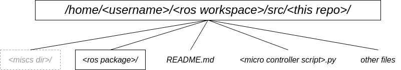

# Project 1: Robot Setup

## 1. Intro
Our goal is to develop a robot with autonomous navigation capability. A variety of sensors, actuators and functionalities will be integrated on the board. In other words, the robot will be "complicated". To ease the complication of managing such a system, [ROS 2 Humble](https://docs.ros.org/en/humble/) will be employed. Given a few start up materials, you'll come up with your design of the mobile robot base; assemble the physical body; and practice basic control and management using ROS.  

## 2. Quick Start
- Since this repository may serve as a container to host a few ROS packages, consider to clone and place this repository under the ROS workspace you are working on. An example of the local location and structure of this repository can be as follows.
- To create a ROS package in your local repository:
```console
cd <ros workspace>/src/<this repo>/
ros2 pkg create --build-type ament-python <package name>
```

## 3. Requirements
1. Build a functional mobile robot base.
2. Program a microcontroller to drive motors and monitor the robot's status.
3. Install and configure ROS. Develop ROS package(s) to publish robot's state and listen to remote control commands. 
4. Test and analyze features of the robot.

### 3.1 Coding
- Please upload your code to this repository. 
- **(25%)** Differential driver on microcontroller:
    - Reads linear and angular velocity commands (for the robot) transfered from the serial port.
    - Outputs signals to approapriate GPIO pins to drive the motor at right speed and direction.
    - Transmits **robot's** linear and angular velocity via serial port at **100 Hz**.
- **(35%)** ROS package for bringing up the robot 
    - The package should contain at least one node. The node(s) should contain a publisher and a subscriber.
    - The node receives the robot's (velocity) states from the microcontroller and transmits the velocity commands to the microcontroller via serial port. 
    - The node publishes the robot's (velocity) state in a topic with **[`geometry_msgs/msg/Twist`](https://docs.ros2.org/latest/api/geometry_msgs/msg/TwistStamped.html)** message at **100 Hz**.
    - The node subscribe to the `/cmd_vel` topic and translate the message according to the microcontroller's script.
    - Verify if the robot is controllable using [`teleop_twist_keyboard`](https://index.ros.org/r/teleop_twist_keyboard/) package.
    
### 3.2 Documentation
- Use this `README` file or create a separate markdown file or upload a pdf file for the documentation.
- Describe the project in concise words. Unless in the Summary section, or:
    - Describe only the final solutions.
    - Don't tell stories.
    - Use more indexed or bulleted paragraphs. 
- Have the documents well organized (break it down into sections). 
- Please include following contents in your documents.
    1. **(10%)** Part list (name, key specifications, functionalities and quantities).
    2. **(15%)** Mechanical layout (sketch(es) with dimensions of key parts and measurements, wiring diagram)
    3. **(8%)** Mechanical features (weight, max velocity, max payload capacity)
    4. **(2%)** Summary this project and share any thoughs or interesting finding.

